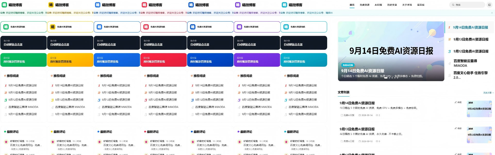
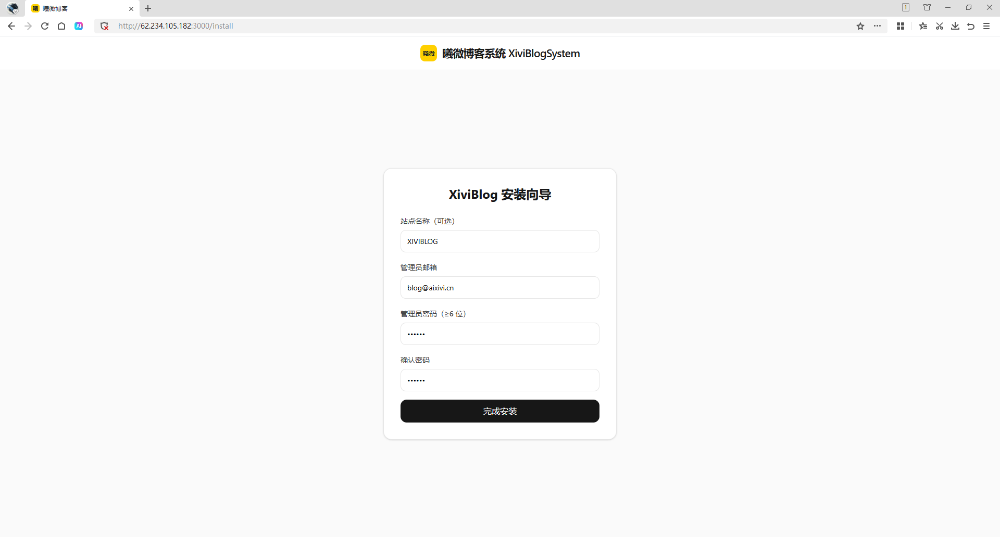
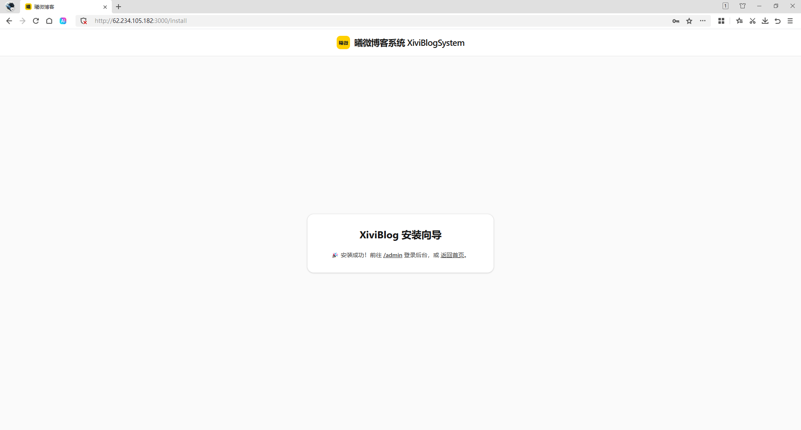
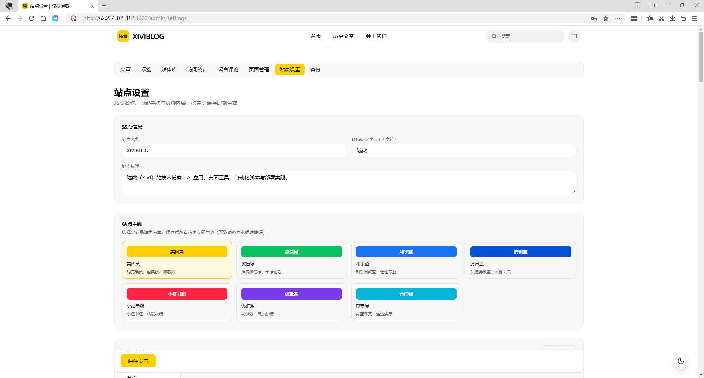
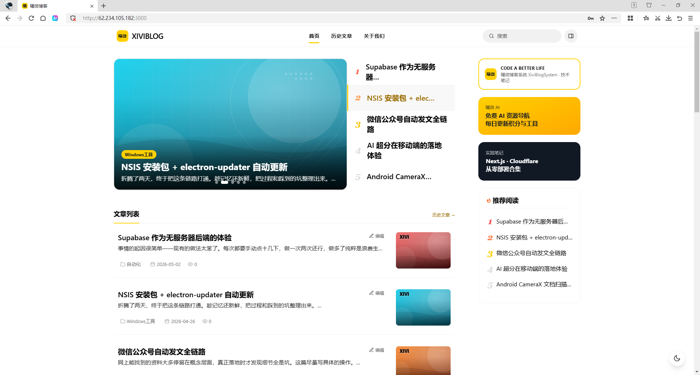
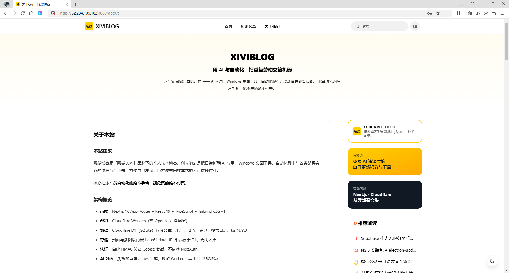

# XiviBlog · 曦微博客

一个跑在 **Cloudflare Workers** 上的轻量级博客系统——可以理解为「手搓版 WordPress」：完整的后台管理、Markdown 写作、主题切换、评论、访问统计，全部零服务器成本，部署即用。

> 技术栈：Next.js 16（App Router）+ React 19 + Tailwind v4 → [OpenNext](https://opennext.js.org/cloudflare) → Cloudflare Workers + D1（SQLite）+ Workers Assets（静态资源）+ Cache API 边缘缓存。

---

## ✨ 功能特性

- **完整后台**：文章（增删改、置顶、定时发布、版本历史）、标签、媒体库、访问统计（含搜索词看板）、站点设置、数据备份。
- **Markdown 编辑器**：16 个工具栏动作、实时预览、粘贴/拖拽传图、分屏滚动同步。
- **多主题**：`--brand` CSS 变量驱动，内置 **7 套配色 × 明暗模式**一键切换，后台保存后即时生效。

  
- **三端自适应**：桌面 / 平板 / 手机，侧边栏可左右互换。
- **边缘缓存**：`custom-worker.ts` 用 Cloudflare Cache API 缓存整页 HTML / RSC / 分页 JSON，重复访问 TTFB 从 1~2.6s 降到 0.25~0.5s。
- **AI 封面**：后台可调用 agnes 等图像模型生成文章封面（密钥存 D1 设置，前端直连生图避免 Workers 出口 IP 限流）。
- **零成本**：Cloudflare 免费额度即可支撑个人博客（Workers 请求、D1 行数、Assets 流量均在免费档内）。

---

## 🧰 环境要求

- Node.js ≥ 20（推荐 22）
- 一个 Cloudflare 账号（免费版即可）
- `wrangler`（`npm i -g wrangler` 或随项目 `npx wrangler`）
- 一个已在 Cloudflare 接入并开启代理（orange-cloud）的域名（可选，也可用 `*.workers.dev` 默认子域）

---

## 🚀 部署到 Cloudflare Workers

### 1. 安装依赖

```bash
npm install
```

### 2. 创建 D1 数据库

```bash
npx wrangler d1 create xivi-blog-db
```

命令会返回一个 `database_id`，把它填进 `wrangler.jsonc` 的 `d1_databases[].database_id`（以及 `migrations/_seed_*.sql` 里若需直连则看第 4 步）。

> ⚠️ 部署前请确认 `wrangler.jsonc` 里的以下字段已改为你自己的：
> - `account_id`
> - `name`（Worker 名称，默认 `xivi-blog`）
> - `d1_databases[].database_id` / `database_name`
> - `routes[].pattern`（你的自定义域名，如 `blog.your.com`）

### 3. 应用数据库结构迁移

仓库 `migrations/` 下是编号的 SQL（`0001_init.sql` … `0015_cover_thumb.sql`）。逐个执行：

```bash
# 跳过下划线开头的种子文件（见第 4 步单独处理）
for f in migrations/0*.sql; do
  case "$(basename "$f")" in _*) continue;; esac
  echo "==> $f"
  npx wrangler d1 execute xivi-blog-db --remote --file="$f"
done
```

> 若你的环境 `--file` 通道异常，可改用 Cloudflare 控制台 D1 的 Query 面板逐文件粘贴执行，或用 `npx wrangler d1 execute xivi-blog-db --remote --command "$(cat 文件路径)"`。

### 4.（可选）初始化管理员与示例文章

```bash
npx wrangler d1 execute xivi-blog-db --remote --file=migrations/_seed_default_user.sql
npx wrangler d1 execute xivi-blog-db --remote --file=migrations/_seed_posts.sql
```

`_seed_default_user.sql` 写入的是一个**占位管理员**（`admin@example.com`，密码不可用）。部署完成后请通过前台 **`/admin/register`** 用「邀请码 = `ADMIN_PASSWORD`」创建你自己的管理员账号，再删除占位账号。

### 5. 设置运行所需 Secret

应用通过 Cloudflare 环境变量读取以下机密（**务必用 secret，不要写进代码或 wrangler.jsonc**）：

```bash
# 会话 HMAC 签名密钥，建议： openssl rand -hex 32
npx wrangler secret put SESSION_SECRET

# 管理员主密钥：作为 /admin/register 邀请码，也用于 /admin/forgot 找回验证
npx wrangler secret put ADMIN_PASSWORD
```

### 6. 构建并部署

```bash
npm run cf:deploy
# 等价于： opennextjs-cloudflare build && wrangler deploy
```

部署成功后 Worker 即可访问；若已配置自定义域名，稍候 DNS 生效即可。

### 7. 创建你的管理员账号

打开 `https://<你的域名>/admin/register`，填写邮箱 / 密码，邀请码填第 5 步设置的 `ADMIN_PASSWORD`，即可登录后台 `/admin`。

---

## 🤖 方式二：AI Agent 一键部署（推荐，5 分钟搞定）

> 不想碰命令行？让 AI Agent 帮你全自动完成全部部署。你只需要一个 Cloudflare 账号和一句指令。

### 前置准备（2 分钟）

| 步骤 | 操作 | 说明 |
| --- | --- | --- |
| ① | 注册 [Cloudflare](https://dash.cloudflare.com/sign-up) 账号 | 免费版即可 |
| ② | 准备一个域名（可选） | 在 Cloudflare 添加你的域名并开启**代理（橙色云朵）**；没有域名也能用 `xxx.workers.dev` 默认子域 |
| ③ | 打开 AI Agent 对话 | [WorkBuddy](https://www.workbuddy.cn) / ChatGPT / Claude / 任何支持代码执行的 AI 助手 |

### 第一步：Fork 仓库

1. 打开 **[yangxivi/XiviBlog](https://github.com/yangxivi/XiviBlog)**
2. 点右上角 **Fork** → 确认 Fork 到你自己的 GitHub 账号下
3. 记住你的仓库名（默认也是 `XiviBlog`）

> 没有 GitHub 账号？先去 [github.com](https://github.com) 注册一个（免费）。

### 第二步：给 AI Agent 下达部署指令

把下面这段话**完整复制**发给 AI Agent（WorkBuddy / ChatGPT / Claude 等），AI 会自动完成剩余全部操作：

```
请帮我把这个博客项目（XiviBlog）一键部署到我的 Cloudflare Workers 上。

【我的信息】
- GitHub 仓库：我已 Fork 了 yangxivi/XiviBlog 到自己的账号下，仓库地址是 https://github.com/<我的用户名>/XiviBlog
- Cloudflare 账号：我已注册，请引导我创建 API Token 或用其他方式授权给你操作
- 域名：我有域名 <你的域名，如 blog.example.com>（如果没有就填"没有，用 workers.dev"）
- 邮箱：<你想用来登录后台的邮箱>

【你需要做的事】（按顺序一步步来，每做完一步告诉我进度）

1. 克隆我的 Fork 仓库到本地
2. 引导我创建 Cloudflare API Token（需要 Edit Cloudflare Workers 权限），或者用 wrangler login 授权
3. 用 wrangler 创建 D1 数据库，拿到 database_id
4. 修改 wrangler.jsonc 中的 account_id、database_id、routes 为我的信息
5. 逐个执行 migrations/ 目录下的所有 SQL 迁移文件（0001~0015，跳过 _seed_ 开头的种子文件）
6. 生成随机的 SESSION_SECRET 和 ADMIN_PASSWORD，通过 wrangler secret put 设置
7. 执行 npm install && npm run cf:build 构建项目
8. 执行 wrangler deploy 部署到 Cloudflare Workers
9. 如果我有域名，帮我在 Cloudflare 添加 DNS 记录（CNAME 指向 Worker）并绑定自定义路由
10. 验证部署成功：访问首页返回 200
11. 告诉我访问 /admin/register 的链接和 ADMIN_PASSWORD 的值，让我去注册管理员账号

【注意事项】
- 不要把任何 Token、密码、Secret 写入代码文件或提交到 Git
- 部署完成后清理临时文件
- 如果某步失败，告诉我具体错误和解决建议
```

### 第三步：按 AI 引导操作（约 3 分钟）

AI 会逐步执行上述步骤，期间可能需要你配合做以下简单操作：

| AI 可能请求你做的 | 你需要做的 | 耗时 |
| --- | --- | --- |
| 「请提供 Cloudflare API Token」 | 打开 [Cloudflare Dashboard → API Tokens → Create Token](https://dash.cloudflare.com/profile/api-tokens) → 选「Edit Cloudflare Workers」模板 → 创建 → 复制 Token 给 AI | 30 秒 |
| 「请确认域名 DNS 配置」 | 去 Cloudflare 的 DNS 管理页面确认多了一条 CNAME/A 记录指向 Worker | 10 秒 |
| 「请打开这个链接注册管理员」 | 浏览器打开 `https://<你的域名>/admin/register`，填邮箱+密码，邀请码填 AI 给你的 `ADMIN_PASSWORD` | 1 分钟 |

### 第四步：验收

部署完成后，你应该能：

- [ ] 打开 `https://<你的域名>` 看到博客首页（7 套主题可切换）
- [ ] 打开 `https://<你的域名>/admin` 用刚注册的账号登录后台
- [ ] 后台写一篇测试文章并发布，前台能看到

### 常见问题

| 问题 | 解决 |
| --- | --- |
| AI 说「wrangler login 超时」 | 国内网络 OAuth 回调会超时，改用 API Token 方式（让 AI 用 `CLOUDFLARE_API_TOKEN` 环境变量） |
| AI 报「域名未接入 Cloudflare」 | 先在 Cloudflare 添加你的域名，把 NS 服务器改成 Cloudflare 提供的，等 DNS 生效后再继续 |
| 部署后访问 404 | 检查 `wrangler.jsonc` 的 `routes[].pattern` 是否匹配你的域名；或先用 `https://<worker名>.workers.dev` 访问确认 Worker 本身正常 |
| 想换域名 / 改配置 | 直接告诉 AI：「帮我把域名从 A 改成 B」，AI 会自动改 `wrangler.jsonc` 并重新部署 |
| 想回滚版本 | 告诉 AI：「回滚到上一个版本」，AI 会 `git checkout` 之前的 commit 并重新部署 |

> 💡 **提示**：整个过程中 AI 会帮你读代码、改配置、跑命令、查错误日志。你不需要懂 Node.js 或 Cloudflare，只需要能在浏览器里点几下、复制粘贴几个值就行。

---

## 🖥 方式三：自托管安装版（VPS / 云服务器，对标 WordPress）

不想用 Cloudflare？本项目额外提供一个**自托管安装版**，代码同源、数据层换成本地 SQLite，能像 WordPress 那样「上传 → 解压 → 网页向导装好」部署到任意 Linux 云服务器。

- 代码在 **`selfhosted/`** 目录（与 Cloudflare 版完全独立，互不影响）。
- 数据库用本地 **SQLite 文件**（`better-sqlite3`），无需 MySQL/PostgreSQL。
- 提供网页安装向导 **`/install`**：填管理员邮箱 + 密码即完成建库与建账号，体验同 `wp-admin/install.php`。
- 安装完成即自带「关于本站」页面与 **20 篇样本文章**，开箱即用。
- 配套 `install.sh`（一键初始化）、`setup-nginx.sh`（域名 + HTTPS）、完整文档 **[selfhosted/README-install.md](selfhosted/README-install.md)**。

### 第 1 步：准备服务器

| 项目 | 要求 |
| --- | --- |
| 系统 | 任意 Linux（Ubuntu / Debian / CentOS 等） |
| Node.js | ≥ 18（推荐 20+） |
| 数据库 | 自带 SQLite，**无需**安装 MySQL/PostgreSQL |
| 内存 | ≥ 512MB 即可 |

Ubuntu/Debian 安装 Node.js：

```bash
curl -fsSL https://deb.nodesource.com/setup_20.x | sudo -E bash -
sudo apt install -y nodejs
```

### 第 2 步：下载安装包，上传到网站根目录

从 [**Releases**](https://github.com/yangxivi/XiviBlog/releases) 下载最新安装包（如 `xiviblog-install-v1.1.0.zip`），上传到你的服务器并解压到网站根目录：

```bash
# 本地执行：上传安装包到服务器（IP 换成你的）
scp xiviblog-install-v1.1.0.zip root@你的服务器IP:/tmp/

# 服务器执行：解压到网站根目录
sudo mkdir -p /var/www/xiviblog
sudo unzip /tmp/xiviblog-install-v1.1.0.zip -d /var/www/xiviblog
cd /var/www/xiviblog
```

### 第 3 步：数据库与配置（.env）

数据库是 **SQLite 文件，自动创建、零配置**——只需告诉它存哪里（默认 `./data/xiviblog.db`，目录自动创建）。

```bash
cp .env.example .env
```

编辑 `.env`，至少修改这两项（`SESSION_SECRET` 用 `openssl rand -hex 32` 生成）：

```ini
SESSION_SECRET=随机长字符串          # 会话签名密钥
ADMIN_PASSWORD=你的后台邀请码        # /admin/register 邀请码 + 找回验证

# 以下保持默认即可
DATABASE_PATH=./data/xiviblog.db    # SQLite 数据库文件路径（自动建库）
SITE_URL=http://localhost:3000      # 对外访问地址（绑域名后改成域名）
PORT=3000                           # 监听端口
```

### 第 4 步：一键安装并启动

```bash
bash install.sh        # 装依赖 + 建库
npm run build          # 首次构建
npm start              # 启动，默认监听 3000
```

建议用 `pm2` 守护进程让服务常驻：

```bash
npm i -g pm2
pm2 start "npm start" --name xiviblog
pm2 save
```

### 第 5 步：域名解析（可选但推荐）

到你的域名服务商（或 Cloudflare）添加一条 **A 记录**：主机记录填 `blog`（或 `@`），记录值填服务器公网 IP。生效后执行：

```bash
bash setup-nginx.sh blog.yourdomain.com   # Nginx 反代 + 免费 HTTPS 证书
```

完成后把 `.env` 里的 `SITE_URL` 改成 `https://blog.yourdomain.com` 并重启服务。

### 第 6 步：XiviBlog 安装向导（关键一步）

浏览器打开 **`http://服务器IP:3000/install`**（已绑域名则用域名），这是全站唯一的入口——未安装前访问任何页面都会被引导到这里：



填写站点名称（可选）、管理员邮箱、管理员密码（≥6 位），点击「完成安装」。向导会自动：

1. 建好全部数据库表；
2. 创建管理员账号；
3. 写入「关于本站」页面与 20 篇样本文章，页脚带 [By XiviBlog](https://blog.aixivi.cn/) 署名。

看到下面这个页面就说明装好了：



### 第 7 步：开始使用

打开 **`/admin`** 用刚才的邮箱密码登录后台。「站点设置」里可以改站名 / LOGO 文字 / 简介、**7 套主题配色**、导航、页脚、友链等，保存即时生效：



回到前台，你的博客已经就绪——首页带轮播、推荐位与样本文章：



「关于本站」也已预填好完整内容（可在后台自由修改）：



> 与 Cloudflare 版的区别：运行环境（Workers vs Node）、数据库（D1 vs 本地 SQLite）、缓存（边缘 vs 反向代理）、安装方式（无界面 vs 网页向导）。两者功能、主题、编辑器完全一致。
>
> 更多细节（忘记密码、换端口、better-sqlite3 编译问题等）见 **[selfhosted/README-install.md](selfhosted/README-install.md)**。

---

## 📊 三种部署方式对比

| 维度 | ① Cloudflare Workers（手动） | ② AI Agent 一键部署（推荐） | ③ 自托管安装版（VPS） |
| --- | --- | --- | --- |
| **适合人群** | 熟悉命令行、Cloudflare 的开发者 | 不想碰命令行的所有用户 | 想完全掌控数据 / 已有 Linux 服务器 |
| **运行环境** | Cloudflare Workers（边缘） | 同①（由 AI 帮你配） | 任意 Linux + Node.js |
| **数据库** | D1（托管 SQLite） | 同① | 本地 SQLite 文件（自动建库） |
| **缓存** | 边缘 Cache API（TTFB 0.25~0.5s） | 同① | 反向代理 / CDN 缓存 |
| **安装过程** | 建库 + secret + `wrangler deploy`，无向导 | 把指令发给 AI，全自动 | 上传解压 → 网页 `/install` 向导（对标 WordPress） |
| **域名 / HTTPS** | 自定义域名或 `*.workers.dev`（Cloudflare 托管证书） | 同① | 需自备域名 + `setup-nginx.sh`（Certbot 免费证书） |
| **成本** | Cloudflare 免费额度（近乎零成本） | 同① | 一台 VPS（几十元/月） |
| **是否需要 Cloudflare 账号** | 必须 | 必须 | 不需要 |
| **数据所有权** | 数据在 Cloudflare D1 | 同① | 数据在自己服务器，完全私有 |
| **运维难度** | 低（平台托管） | 最低（AI 代劳） | 中（自行维护 Node/进程/证书） |
| **扩展性** | 跟着 Cloudflare 全球边缘走 | 同① | 受单机规格限制 |
| **典型上手时间** | 30~60 分钟 | 5 分钟 | 10~20 分钟（含服务器准备） |
| **开箱即用内容** | 空站，需自行注册管理员、发文 | 同① | 装好即带「关于本站」+ 20 篇样本文章、页脚 By XiviBlog |

---

## 💻 本地开发

```bash
# 纯前端预览（不连 Cloudflare）
npm run dev

# 连 Cloudflare（D1 / 缓存）本地预览，需要先有 wrangler 配置
npm run cf:preview
```

本地连 D1 时，机密可放在 `.dev.vars`（已被 .gitignore 忽略，**切勿提交**）：

```ini
SESSION_SECRET=dev-only-secret
ADMIN_PASSWORD=dev-only-master
```

---

## 🗂 项目结构

```
blog/
├─ app/                  # Next.js App Router：页面 + /api 路由 + /admin 后台
│  ├─ api/               # auth / posts / pages / media / cover / stats ...
│  └─ admin/             # 登录、注册、编辑器、设置、统计等后台界面
├─ lib/                  # 核心逻辑：db（D1 封装）、auth、markdown、settings、revisions
├─ components/           # UI 组件
├─ custom-worker.ts      # Cloudflare 边缘缓存层（Cache API）
├─ open-next.config.ts   # OpenNext 构建配置
├─ wrangler.jsonc        # Cloudflare Workers / D1 / Assets / 路由 配置
├─ migrations/           # D1 结构迁移（0001-0016）+ 两个 _seed_*.sql 种子
├─ public/               # 静态资源（covers / svg；文章配图 shots/ 不入库）
├─ scripts/              # 运维脚本（见下）
└─ .env.example          # 本地环境变量模板
```

---

## ⚙️ 配置说明

### 环境变量 / Secret

| 名称 | 类型 | 说明 |
| --- | --- | --- |
| `SESSION_SECRET` | Secret | 会话签名密钥，`openssl rand -hex 32` 生成 |
| `ADMIN_PASSWORD` | Secret | 管理员主密钥；`/admin/register` 邀请码、`/admin/forgot` 找回验证 |
| `CLOUDFLARE_API_TOKEN` | 本地 | 运维脚本（如 `scripts/`）直连 D1 HTTP API 用，从环境变量读取，**不写入仓库** |
| `CLOUDFLARE_ACCOUNT_ID` / `CLOUDFLARE_DATABASE_ID` | 本地 | 同上，运维脚本可覆盖的默认值 |

### AI 封面（可选）

后台「AI 生成封面」依赖一个图像生成 API（默认 agnes）。相关配置（Base URL / 模型 / Key）保存在 D1 的站点设置里（后台「站点设置 → AI 封面」），**不在代码或环境变量中**。前端拿到提示词后直连图像服务生图，避免 Workers 共享出口 IP 被限流。

---

## 🛠 运维脚本（`scripts/`）

| 脚本 | 作用 |
| --- | --- |
| `migrate-about-to-pages.mjs` | 把「关于本站」从 settings 迁移到 pages 表 |
| `rebuild-thumbs-webp.py` | 把全部封面缩略图用 WebP 重新生成（需 `Pillow` + 环境变量 `CLOUDFLARE_API_TOKEN`） |
| `update-timeline.mjs` | 把迭代记录追加到「关于本站」时间轴 |

> 其余 `verify-*` / `probe-*` / `*-check` 等内部 QA 脚本含真实后台凭据，已被 `.gitignore` 排除，不会进入仓库。

---

## 🔒 安全约定

- **任何机密（API Token、管理员密码）都不入库**：Token 仅从环境变量读取；管理员密码通过 `ADMIN_PASSWORD` Secret 与注册/找回流程管理。
- `.env`、`.dev.vars`、本地日志均已被 `.gitignore` 忽略。
- 文章插图走 `public/shots/` 静态外链，不内嵌 base64，避免撑大 D1、拖慢边缘缓存。

---

## 📄 License

仅供个人学习与使用。如需商用或二次分发，请自行评估合规要求。
